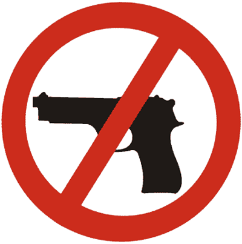

# pewpew_stopper  

## End-to-End solution to detecting handguns 
- Data preprocessing and augmentation on RoboFlow
- YoloV4 (PyTorch) is trained on a pistol dataset using Colab (bless you Google and your infinite cash pile) 
- PyTorch --> ONNX 
- Running model with TensorRT on Nvidia Jetson Xavier NX to make use of those nice DLA's (Deep Learning Accelerators, for inference)
